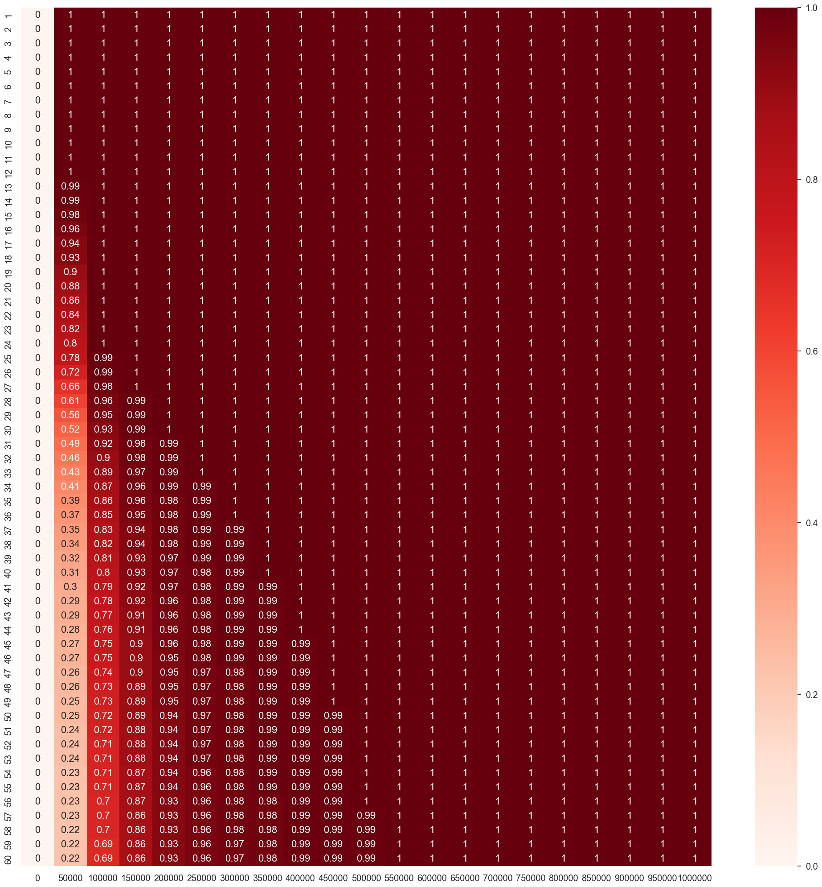

# Comprehensive Guide to Monte Carlo Simulations for Financial Planning

## Overview
This document details a sophisticated financial simulation using the Monte Carlo method, tailored for asset management and retirement planning. The approach integrates real-world economic factors like market fluctuations and inflation impacts, presenting a pragmatic scenario for both asset growth and retirement strategies.

## Methodology

### Data Acquisition
- **Asset Selection**: The model uses the S&P 500 as a benchmark for investments, fetching annual return data through Yahoo Finance. The data helps in understanding market trends over a specified period, contributing to more accurate simulations.

### Simulation Setup
- **Monte Carlo Simulations**: The method involves simulating various combinations of financial events over multiple years, considering 3-year cyclical market trends to reflect realistic economic cycles. This part of the process is critical for capturing the varied outcomes in investment returns.

### Financial Scenarios
- **Employment and Retirement Phases**: The model delineates two main financial phases:
  - **Employment (Barista FIRE scenario)**: Simulates a working individual's life, integrating job income with investment returns. Expenditures exceeding earnings affect investment capital, mimicking real-life financial planning.
  - **Retirement**: Focuses on the withdrawal phase, adjusting for inflation to maintain the purchasing power of the retiree.

### Inflation Modeling
- **Dynamic Inflation Adjustment**: The model includes multiple methods for projecting inflation, such as constant, real, and lognormal distributions, ensuring that the simulations remain relevant under various economic conditions.

### Investment and Buffer Management
- **Buffer Strategy**: Acknowledges the necessity of maintaining liquidity through conservative investments or buffer accounts, crucial during market downturns to prevent capital erosion.

### Taxation and Costs
- **Realistic Fiscal Impact**: Incorporates country-specific tax implications on investments, simulating the after-tax return on investments which is vital for realistic financial planning.

### Estate Planning
- **Inheritance Simulation**: Optionally simulates scenarios where non-liquid assets (like real estate) are inherited, adding complexity and realism to the simulations, reflecting potential future financial boosts.

### Simulation Execution
- **Annual Operations**: Each year within the simulation adjusts the financial parameters based on the market returns, inflation rates, and other economic factors, recalculating the investment values and buffer necessities.

### Output Analysis
- **Probability of Financial Survival**: The main outcome is the probability of not outliving one's investments, calculated annually across different starting capitals and strategies, providing a robust framework for assessing financial health over time.

## Conclusion
The detailed simulation provides a comprehensive toolkit for individual investors to plan their finances with a high degree of customization and foresight. By integrating real-world economic variables and personal financial goals, the model serves as an invaluable resource for both current financial stability and future retirement planning.
